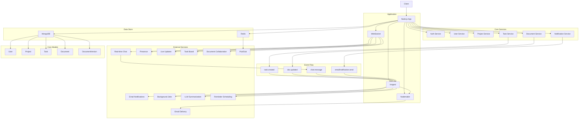

```mermaid
graph TB
    A[Client] --> B[Node.js App]
    B --> C[MongoDB]
    B --> D[Redis]
    B --> E[WebSocket]
    B --> F[Inngest]
    B --> G[Nodemailer]
    E --> H[Real-time Chat]
    E --> I[Presence]
    E --> J[Live Updates]
    E --> K[Task Board]
    E --> L[Document Collaboration]
    D --> M[Pub/Sub]
    F --> N[Email Notifications]
    F --> O[Background Jobs]
    F --> P[LLM Summarization]
    F --> Q[Reminder Scheduling]
    G --> R[Email Delivery]
    
    subgraph "Application"
        B
        E
        F
        G
    end
    
    subgraph "Data Store"
        C
        D
    end
    
    subgraph "External Services"
        H
        I
        J
        K
        L
        M
        N
        O
        P
        Q
        R
    end
    
    subgraph "Core Models"
        S[User]
        T[Project]
        U[Task]
        V[Document]
        W[DocumentVersion]
    end
    
    C --> S
    C --> T
    C --> U
    C --> V
    C --> W
    
    subgraph "Core Services"
        X[Auth Service]
        Y[User Service]
        Z[Project Service]
        AA[Task Service]
        AB[Document Service]
        AC[Notification Service]
    end
    
    B --> X
    B --> Y
    B --> Z
    B --> AA
    B --> AB
    B --> AC
    
    subgraph "Event Flow"
        AD[task.created]
        AE[doc.updated]
        AF[chat.message]
        AG[email/notification.send]
    end
    
    AA --> AD
    AB --> AE
    H --> AF
    AC --> AG
    
    AD --> F
    AE --> F
    AF --> F
    AG --> F
    
    F --> G
```